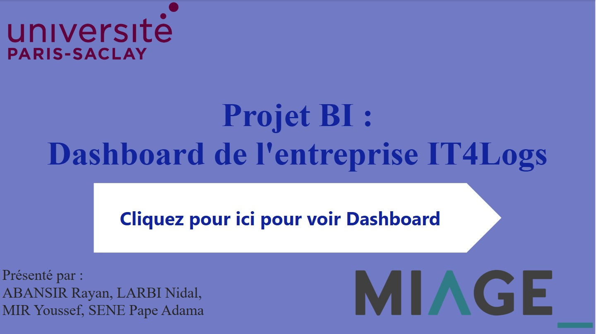
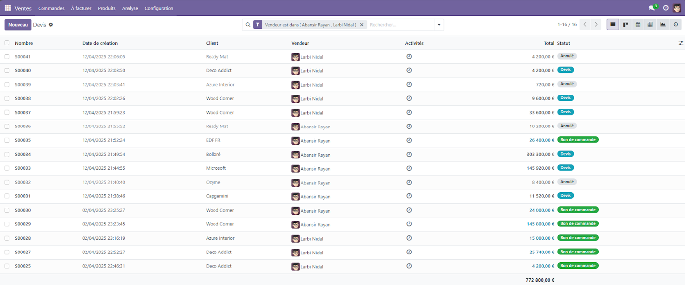
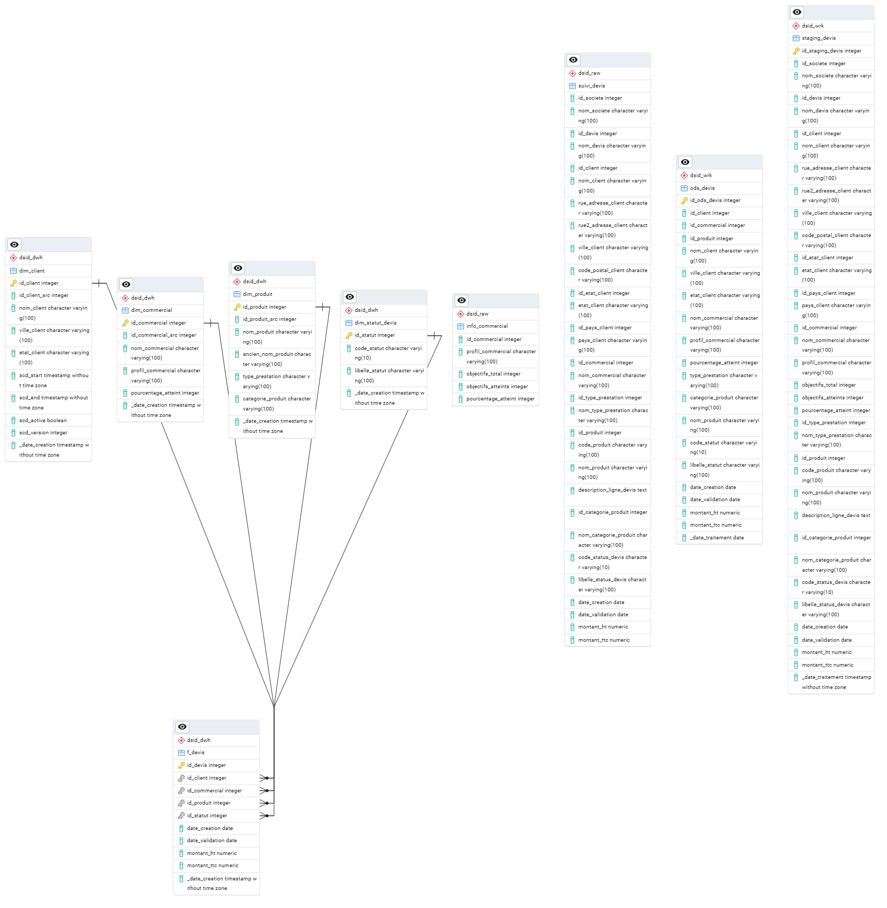
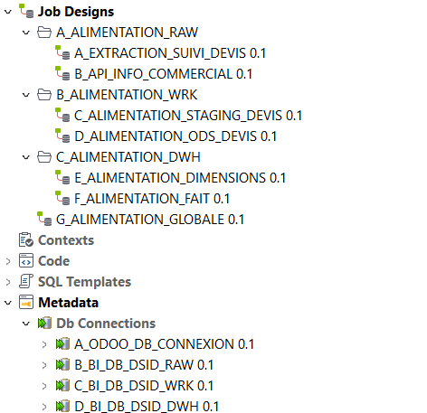
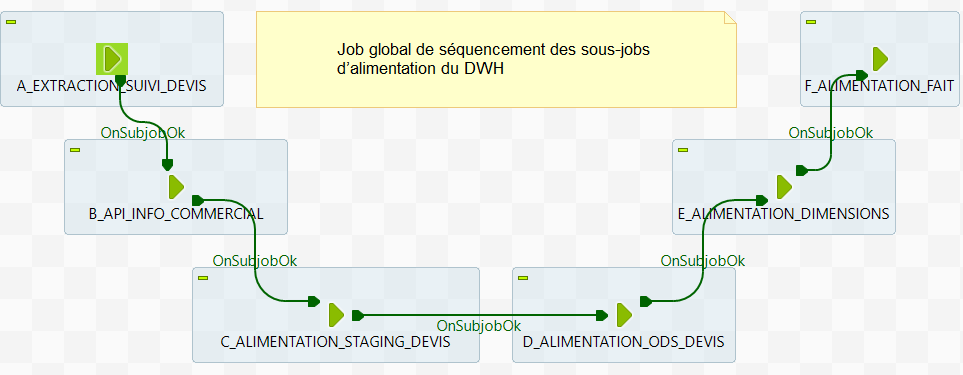
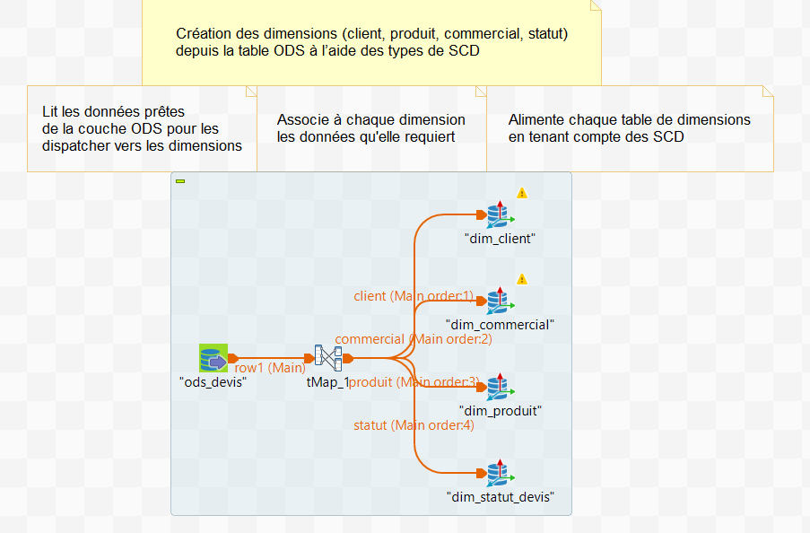
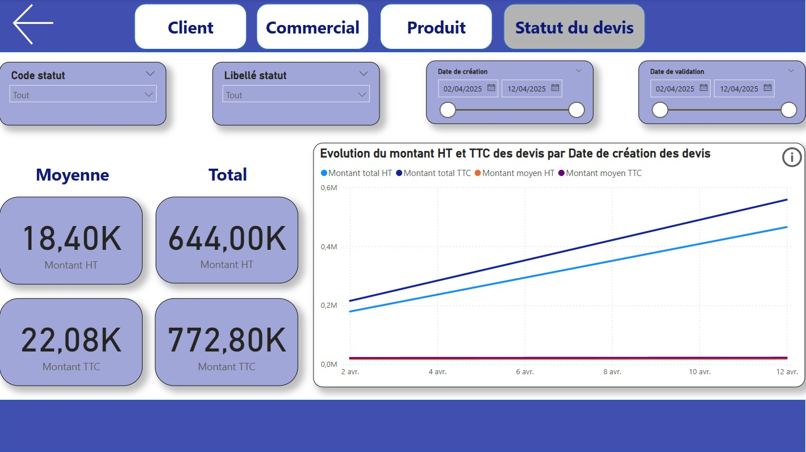
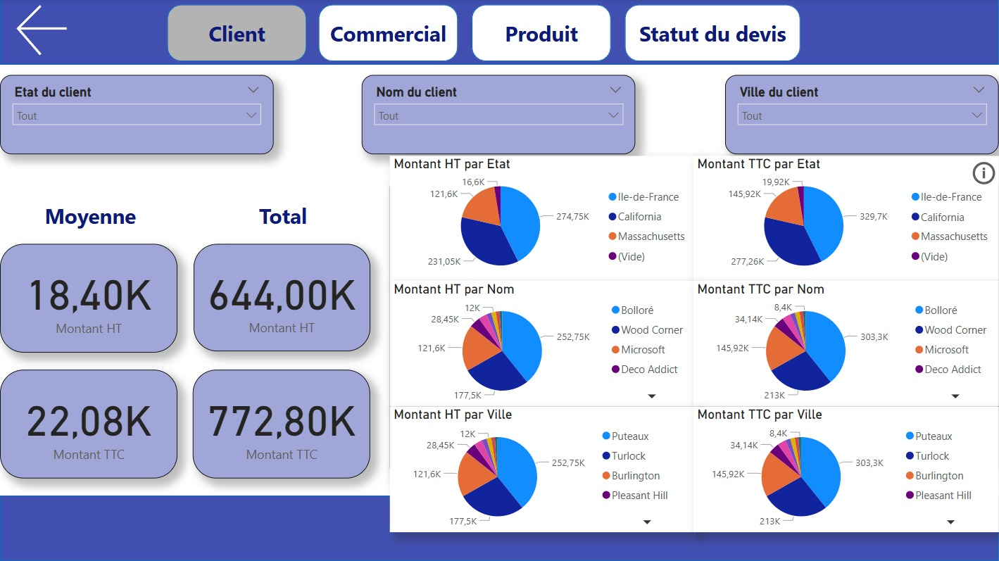

# IT4Logs · Solution BI de suivi des devis commerciaux

> Chaîne décisionnelle complète : Odoo et API REST → Talend → datamart PostgreSQL en étoile → dashboards Power BI.



📄 **Rapport du projet :** [rapport/Rapport_Projet_BI_IT4Logs.pdf](rapport/Rapport_Projet_BI_IT4Logs.pdf) · version Word : [Rapport_Projet_BI_IT4Logs.docx](rapport/Rapport_Projet_BI_IT4Logs.docx)

---

## Contexte

**IT4Logs** est un éditeur de logiciels de comptabilité qui souhaite mettre en place une solution décisionnelle pour suivre l’activité de ses commerciaux en phase d’avant-vente.

Le projet consiste à construire un datamart et des dashboards Power BI pour analyser les devis, de leur saisie dans le CRM Odoo jusqu’à leur visualisation, via une chaîne complète de traitement des données.

---

## Architecture

```txt
┌──────────────┐
│   Odoo CRM   │──┐
│ (vue devis)  │  │     ┌──────────────────────────────────────────────┐     ┌──────────────┐
└──────────────┘  ├───▶ │ Talend : RAW → STAGING → ODS → DWH (étoile)  │ ──▶ │   Power BI   │
┌──────────────┐  │     │          PostgreSQL (datamart)               │     │  dashboards  │
│  API REST    │──┘     └──────────────────────────────────────────────┘     └──────────────┘
│ (json-server)│
└──────────────┘
```

| Couche | Schéma PostgreSQL | Tables |
|---|---|---|
| Données brutes | `dsid_raw` | `suivi_devis` (Odoo), `info_commercial` (API) |
| Zone de travail | `dsid_wrk` | `staging_devis`, `ods_devis` |
| Datawarehouse | `dsid_dwh` | `f_devis`, `dim_client`, `dim_commercial`, `dim_produit`, `dim_statut_devis` |

---

## Étapes du projet

### 1. Sources de données

- **Odoo :** les devis sont saisis par les commerciaux dans le CRM (client, commercial, montant, statut). Un extrait de la vue `suivi_devis` est disponible dans [data/vue_suivi_devis_odoo.csv](data/vue_suivi_devis_odoo.csv).
- **API REST :** une API locale créée avec `json-server` simule une source externe exposant les informations des commerciaux (profil, objectifs, pourcentage d’atteinte). Voir [data/api_commerciaux.json](data/api_commerciaux.json).



### 2. Modélisation du datamart

Le datamart a été modélisé en **étoile** avec l’outil ERD de pgAdmin : une table de faits `f_devis` (montants HT et TTC) reliée à quatre dimensions (client, commercial, produit, statut). Des séquences PostgreSQL génèrent les clés techniques de toutes les tables. Le script de création est disponible dans [sql/datamart_schema.sql](sql/datamart_schema.sql).



### 3. Alimentation avec Talend

Le projet Talend complet est disponible dans [talend/](talend/PROJET_BI_GROUPE1_TALEND_SUIVI_DEVIS). Les jobs sont organisés par couche :



| Job | Rôle |
|---|---|
| `A_EXTRACTION_SUIVI_DEVIS` | Extraction de la vue Odoo vers `dsid_raw.suivi_devis` |
| `B_API_INFO_COMMERCIAL` | Appel de l’API (`tRESTClient`, `tExtractJSONFields`) vers `dsid_raw.info_commercial` |
| `C_ALIMENTATION_STAGING_DEVIS` | Jointure des devis et des infos commerciales (`tMap`) vers `staging_devis` |
| `D_ALIMENTATION_ODS_DEVIS` | Nettoyage et sélection des colonnes utiles vers `ods_devis` |
| `E_ALIMENTATION_DIMENSIONS` | Alimentation des dimensions avec gestion des SCD |
| `F_ALIMENTATION_FAIT` | Alimentation de la table de faits `f_devis` |
| `G_ALIMENTATION_GLOBALE` | Orchestration de tous les jobs (`OnSubjobOk`) |



#### Gestion de l’historique (SCD)

| Dimension | Stratégie |
|---|---|
| `dim_client` | **Type 2** sur le nom, l’état et la ville : chaque changement crée une nouvelle version, pour retrouver l’état du client à une date donnée |
| `dim_commercial` | **Type 1** : seule la dernière valeur du profil et des objectifs est conservée |
| `dim_produit` | **Type 1** sur la catégorie et le type de prestation, **type 3** sur le nom (l’ancien nom est conservé en cas de renommage) |
| `dim_statut_devis` | Table de référence, sans historisation |

Dans toutes les dimensions, la date de création est traitée en **type 0** (valeur figée).



### 4. Dashboards Power BI

Le rapport Power BI ([powerbi/IT4Logs_suivi_devis.pbix](powerbi/IT4Logs_suivi_devis.pbix)) propose quatre onglets d’analyse : **Client**, **Commercial**, **Produit** et **Statut du devis**. Chaque page offre des filtres dynamiques et présente les montants HT et TTC (moyennes, totaux, répartitions et évolution dans le temps).





---

## Contenu du dépôt

```txt
├── data/
│   ├── vue_suivi_devis_odoo.csv     # Extrait de la vue devis d’Odoo
│   └── api_commerciaux.json         # Données servies par json-server
├── sql/
│   └── datamart_schema.sql          # Création des schémas RAW, WRK et DWH
├── talend/                          # Projet Talend Open Studio (jobs ETL)
├── powerbi/
│   └── IT4Logs_suivi_devis.pbix     # Dashboards Power BI
├── rapport/                         # Rapport du projet (PDF et Word)
└── images/                          # Captures des jobs et des dashboards
```

---

## Reproduire le projet

1. **Base de données :** créer une base PostgreSQL, puis exécuter `sql/datamart_schema.sql`.
2. **API :** lancer `npx json-server data/api_commerciaux.json --port 3000`.
3. **Talend :** importer le dossier `talend/PROJET_BI_GROUPE1_TALEND_SUIVI_DEVIS` dans Talend Open Studio for Data Integration (8.0), puis renseigner les connexions (`Metadata > Db Connections`) avec vos propres paramètres.
4. **Exécution :** lancer le job `G_ALIMENTATION_GLOBALE`.
5. **Power BI :** ouvrir `powerbi/IT4Logs_suivi_devis.pbix`.

> Pour des raisons de sécurité, les mots de passe des connexions ont été retirés du projet Talend publié.

---

## Stack technique

| Étape | Outil |
|---|---|
| Source CRM | Odoo |
| Source API | json-server |
| ETL | Talend Open Studio for Data Integration |
| Stockage | PostgreSQL (pgAdmin) |
| Visualisation | Power BI Desktop |

---

## Équipe

Projet réalisé dans le cadre du **Master 1 MIAGE, Université Paris-Saclay** (module DSID).

| Membre | Contribution |
|---|---|
| Rayan Abansir | Alimentation des dimensions (avec SCD) et de la table de faits via Talend |
| Nidal Larbi | Construction du datamart avec pgAdmin et alimentation de l’ODS via Talend |
| Youssef Mir | Création des données dans Odoo et alimentation des tables RAW via Talend |
| Pape Adama Sene | Alimentation de la table de staging via Talend et création du dashboard Power BI |
